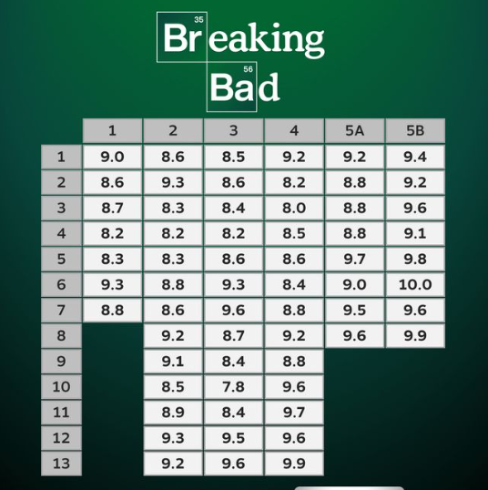
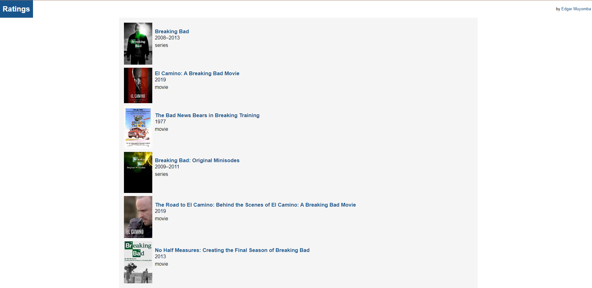
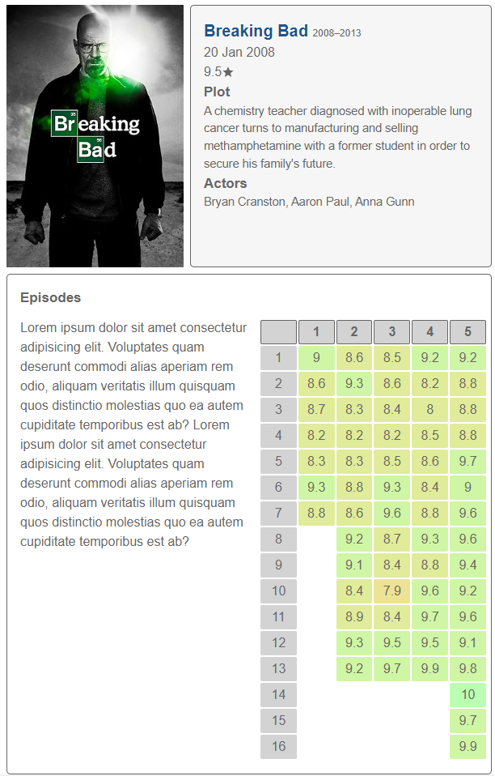
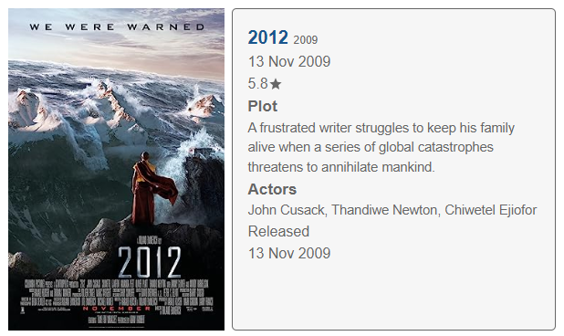

# Ratings
This is a project used to find the ratings of movies and series and compile them into a single image. This project is based on the work of [Roberto Sorio](https://www.tiktok.com/@robertosorio08).
It uses a combination of api calls and web scraping in python. 



this is a sample from Roberto Sorio

## Description
When a user searches for a movie or a serie, the [omdbapi](https://www.omdbapi.com/) is queried to return a list of results to the user.
When the user selects a movie they are interested in, a webscraper is launched using python to the [imdb](https://imdb.com/) website. This collects either the overall rating ( for a movie ) or the ratings of the all the episodes. ( for a series ).
It combines all the results onto a single page thats returned to the user.

## Screenshots
Search results page


Series Ratings


Movie Results


## Setting up dev
**Instructions for windows OS**
1. Clone the repository into your desired directory
   ```
   git clone https://github.com/edgarmuyomba/ratings.git
   ```
2. Enter the created folder `ratings` using the terminal. Make sure you have python installed for the next steps.
3. Create a virtual environment
   ```
   python -m venv <name>
   ```
4. Activate the virtual environment
   ```
   <name>\script\activate
   ```
5. Install the required dependencies
   ```
   pip install -r requirements.txt
   ```
6. Run the server. Access the demo on [localhost:8000](http://localhost:8000/)
   ```
   python manage.py runserver
   ```

## Built with
1. [Python](https://www.python.org/)
2. [Django](https://www.djangoproject.com/)
3. [Beautiful Soup 4](https://pypi.org/project/beautifulsoup4/)
4. [Requests](https://pypi.org/project/requests/)

> [!CAUTION]
> System might fail to run as expected due to changes in the imdb website structure or chnages with the working of the omdb api. Regular updates are rolled out to ensure its continued operation. Thank you